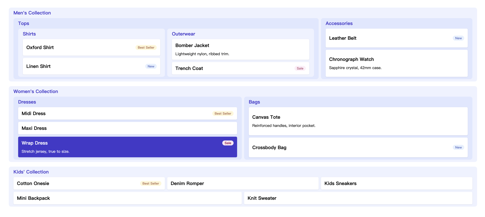

# react-nested-grid

轻量级 React 组件，用于渲染 JSON 驱动的嵌套网格布局。



## 安装

```bash
npm install react-nested-grid
```

## 快速开始

```tsx
import { NestedGrid, type NestedGridNode } from 'react-nested-grid'

const nodes: NestedGridNode[] = [
  {
    id: 'inventory',
    title: '库存管理',
    columns: 2,
    children: [
      {
        id: 'electronics',
        title: '电子产品',
        children: [
          { id: 'laptop', title: '笔记本电脑', content: '14" 和 16" 型号有货' },
          { id: 'monitor', title: '显示器', content: '4K USB-C 显示器' },
        ],
      },
      {
        id: 'furniture',
        title: '家具',
        children: [
          { id: 'desk', title: '办公桌', content: '可调节升降桌' },
          { id: 'chair', title: '办公椅', content: '人体工学网布椅' },
        ],
      },
    ],
  },
]

export function App() {
  return <NestedGrid nodes={nodes} />
}
```

## 节点结构

```ts
interface NestedGridNode<TData = unknown> {
  id: React.Key
  title?: React.ReactNode
  content?: React.ReactNode
  children?: NestedGridNode<TData>[]
  columns?: number
  span?: number
  data?: TData
}
```

- 有 `children` 的节点为**分组**（group）；没有 `children` 的为**条目**（item）。
- `columns` 设置该节点子网格的列数，未设置时回退到 `defaultColumns`（默认 `1`）。
- `span` 让节点在父级网格中跨多列。
- `data` 为自定义数据，透传到渲染回调中。

## 组件

### NestedGrid

根组件。接收 `nodes` 数组，渲染完整嵌套网格。

```tsx
<NestedGrid
  nodes={nodes}
  defaultColumns={3}
  groupGap={12}
  itemGap={8}
  renderGroup={...}
  renderItem={...}
/>
```

### NestedGridItem

默认的叶子条目。内容默认隐藏，hover 时展开。导出供自定义 `renderItem` 复用。

```tsx
import { NestedGrid, NestedGridItem } from 'react-nested-grid'
;<NestedGrid
  nodes={nodes}
  renderItem={({ node }) => (
    <NestedGridItem node={node} showContent titleExtra={({ expanded }) => (expanded ? '▼' : '▶')} />
  )}
/>
```

| 属性          | 类型                                       | 默认值  | 说明                              |
| ------------- | ------------------------------------------ | ------- | --------------------------------- |
| `node`        | `NestedGridNode`                           | 必填    | 要渲染的节点                      |
| `titleExtra`  | `ReactNode \| ({ expanded }) => ReactNode` | —       | 标题旁的额外内容                  |
| `showContent` | `boolean`                                  | `false` | 始终展示内容，而非仅 hover 时展示 |
| `className`   | `string`                                   | —       | 附加 CSS 类名                     |
| `style`       | `CSSProperties`                            | —       | 内联样式                          |

### NestedGridGroup

默认的分组容器。渲染分组边框、标题头和内容区域。导出供自定义 `renderGroup` 复用。

```tsx
import { NestedGrid, NestedGridGroup } from 'react-nested-grid'
;<NestedGrid
  nodes={nodes}
  renderGroup={({ node, children, depth }) => (
    <NestedGridGroup node={node} style={{ background: depth % 2 === 0 ? '#f8fafc' : '#ffffff' }}>
      {children}
    </NestedGridGroup>
  )}
/>
```

| 属性        | 类型             | 说明             |
| ----------- | ---------------- | ---------------- |
| `node`      | `NestedGridNode` | 要渲染的分组节点 |
| `children`  | `ReactNode`      | 已渲染的子网格   |
| `className` | `string`         | 附加 CSS 类名    |
| `style`     | `CSSProperties`  | 内联样式         |

### themeToVars

`themeToVars(theme)` 将 `NestedGridTheme` 转为 CSS 变量 style 对象。所有内置组件内部都使用它 — 直接给任意组件传 `theme` prop 即可设置或覆盖当前层级的样式变量。

```tsx
import { NestedGridGroup, themeToVars } from 'react-nested-grid'

;<NestedGridGroup node={node} theme={{ groupBorder: '2px solid red' }}>
  ...
</NestedGridGroup>
```

## 自定义渲染

`renderGroup` 和 `renderItem` 均可替换默认渲染，它们共享相同的回调参数：

```ts
{
  node // 当前节点
  depth // 嵌套深度（根 = 0）
  index // 在兄弟节点中的位置
  parent // 父节点（根级为 undefined）
  oriNode // 默认渲染的元素
}
```

`renderGroup` 额外接收 `children`（已渲染的子网格）。

自定义渲染结果会被包裹在框架管理的 div 中，该 div 处理网格定位（`gridColumn` span、`min-width`），你只需关注内容和样式。

```tsx
<NestedGrid
  nodes={nodes}
  renderGroup={({ node, children, depth, oriNode }) => (
    <NestedGridGroup node={node} style={{ background: depth === 0 ? '#f0fdf4' : undefined }}>
      {children}
    </NestedGridGroup>
  )}
  renderItem={({ node, oriNode }) => (
    <a href={`/item/${node.id}`} style={{ textDecoration: 'none' }}>
      {oriNode}
    </a>
  )}
/>
```

## 自定义样式

### Theme

推荐使用 `theme` 属性来定制外观。它接收一个扁平的 CSS 值对象，底层转为 CSS 自定义属性挂载到根元素上，所有子组件自动继承。

```tsx
import { NestedGrid, type NestedGridTheme } from 'react-nested-grid'

const theme: NestedGridTheme = {
  // 分组
  groupBorder: 'none',
  groupTitleColor: '#2563eb',
  groupBgEven: '#eff6ff',
  groupBgOdd: '#dbeafe',

  // 条目
  itemBorder: 'none',
  itemShadow: '0 2px 6px rgb(0 0 0 / 6%)',
  itemHoverBg: '#2563eb',
  itemHoverColor: '#ffffff',

  // 内容
  contentFontSize: '13px',
  contentColor: '#64748b',
  contentAnimDuration: '150ms',
}

<NestedGrid nodes={nodes} theme={theme} />
```

| 属性                         | 对应 CSS                | 默认值              |
| ---------------------------- | ----------------------- | ------------------- |
| `groupBorder`                | `border`                | `1px solid #e5e7eb` |
| `groupBorderRadius`          | `border-radius`         | `8px`               |
| `groupBgEven` / `groupBgOdd` | `background`            | —                   |
| `groupTitleColor`            | `color`                 | —                   |
| `groupTitleFontSize`         | `font-size`             | —                   |
| `groupTitleFontWeight`       | `font-weight`           | `600`               |
| `groupHeaderPadding`         | `padding`               | `8px 16px`          |
| `groupBodyPadding`           | `padding`               | `0 16px 8px`        |
| `itemBorder`                 | `border`                | `1px solid #e5e7eb` |
| `itemBorderRadius`           | `border-radius`         | `4px`               |
| `itemBg`                     | `background`            | `#ffffff`           |
| `itemShadow`                 | `box-shadow`            | —                   |
| `itemPadding`                | `padding`               | `10px 12px`         |
| `itemHoverBg`                | `background`（hover）   | `#f3f4f6`           |
| `itemHoverColor`             | `color`（hover）        | —                   |
| `itemTitleFontSize`          | `font-size`             | —                   |
| `itemTitleFontWeight`        | `font-weight`           | `600`               |
| `contentColor`               | `color`                 | —                   |
| `contentFontSize`            | `font-size`             | `13px`              |
| `contentLineHeight`          | `line-height`           | `20px`              |
| `contentPaddingTop`          | `padding-top`（展开时） | `8px`               |
| `contentAnimDuration`        | 过渡动画时长            | `200ms`             |

### 深度类名

每个网格单元自动添加 `rng-depth-{n}`、`rng-depth-even`（或 `rng-depth-odd`）类名，无需在 `renderGroup` 中手动判断深度。

```css
/* 第一层分组加粗边框 */
.rng-depth-0 > .rng-group {
  border-width: 2px;
}

/* 按奇偶深度交替背景 */
.rng-depth-even > .rng-group {
  background: #f1f5f9;
}
.rng-depth-odd > .rng-group {
  background: #ffffff;
}
```

### CSS 类名覆盖

`theme` 无法覆盖的细节，可直接覆盖 `rng-*` 类名。

```css
.rng-item-title {
  text-transform: uppercase;
  letter-spacing: 0.05em;
}
```

## Props 参考

```ts
interface NestedGridTheme {
  groupBgEven?: CSSProperties['background']
  groupBgOdd?: CSSProperties['background']
  groupBorder?: CSSProperties['border']
  groupBorderRadius?: CSSProperties['borderRadius']
  groupTitleColor?: CSSProperties['color']
  groupTitleFontSize?: CSSProperties['fontSize']
  groupTitleFontWeight?: CSSProperties['fontWeight']
  groupHeaderPadding?: CSSProperties['padding']
  groupBodyPadding?: CSSProperties['padding']
  itemBg?: CSSProperties['background']
  itemBorder?: CSSProperties['border']
  itemBorderRadius?: CSSProperties['borderRadius']
  itemShadow?: CSSProperties['boxShadow']
  itemPadding?: CSSProperties['padding']
  itemHoverBg?: CSSProperties['background']
  itemHoverColor?: CSSProperties['color']
  itemTitleFontSize?: CSSProperties['fontSize']
  itemTitleFontWeight?: CSSProperties['fontWeight']
  contentColor?: CSSProperties['color']
  contentFontSize?: CSSProperties['fontSize']
  contentLineHeight?: CSSProperties['lineHeight']
  contentPaddingTop?: CSSProperties['paddingTop']
  contentAnimDuration?: string
}

interface NestedGridProps<TData = unknown> {
  nodes: NestedGridNode<TData>[]
  defaultColumns?: number // 默认 1
  groupGap?: number | string | [number | string, number | string]
  itemGap?: number | string | [number | string, number | string]
  theme?: NestedGridTheme
  className?: string
  renderGroup?: (props: NestedGridGroupRenderProps<TData>) => ReactNode
  renderItem?: (props: NestedGridItemRenderProps<TData>) => ReactNode
}

interface NestedGridGroupProps<TData = unknown> {
  node: NestedGridNode<TData>
  children: ReactNode
  className?: string
  style?: CSSProperties
}

interface NestedGridItemProps<TData = unknown> {
  node: NestedGridNode<TData>
  titleExtra?: ReactNode | ((props: { expanded: boolean }) => ReactNode)
  showContent?: boolean
  className?: string
  style?: CSSProperties
}
```

## 构建

```bash
npm install
npm run build
```

使用 Vite library 模式构建，`tsc` 生成类型声明，`tsc-alias` 修复路径别名。样式内联到入口文件，使用者无需额外导入 CSS。

## 本地开发

```bash
npm run dev
```

Vite 开发服务器指向 `examples` 目录。包名已别名到 `src/index.ts`，源码修改即时热更新，同时保持与真实使用方式一致。完整示例见 `examples/` 文件夹。
